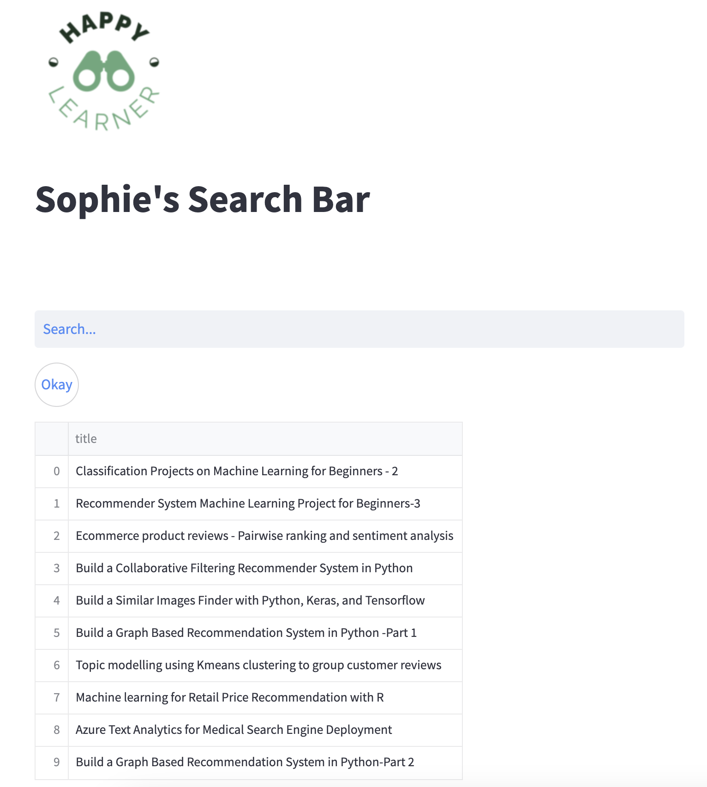
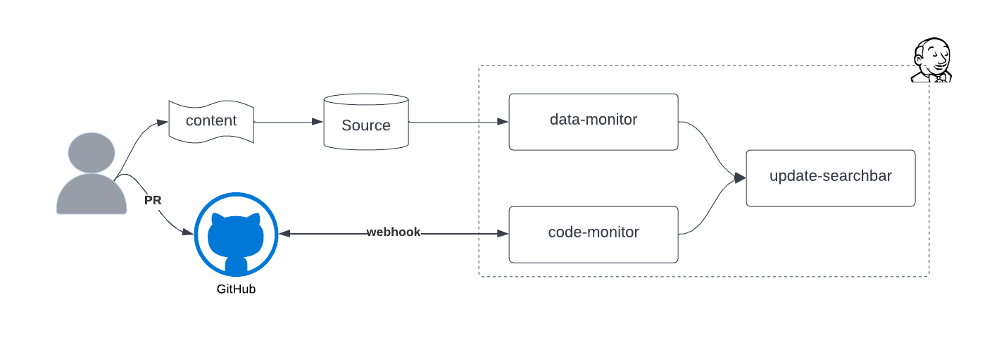

# CI/CD Pipeline for Search Engine Application

## Business Overview

Delivering a new software version requires an organized and automated series of steps, collectively known as the Continuous Integration and Continuous Deployment (CI/CD) pipeline. This pipeline directs the software development process through development, testing, and deployment, with an emphasis on automation to minimize human error and ensure consistency.

The primary goal of this project is to establish a CI/CD pipeline for a search engine application using Jenkins, a renowned open-source automation server.

## About the Search Engine Application

The search engine application utilizes the Faiss similarity search algorithm and is deployed on Streamlit. With the search bar, users can effortlessly find project descriptions, as the application organizes them into a streamlined index and displays the most relevant results.

Leveraging SBERT, a variant of the pre-trained BERT network, I generate sentence embeddings for each description. These embeddings can then be compared using cosine-similarity, enabling a semantic search across numerous sentences in just a few seconds. To retrieve the top results, I use the Facebook AI Similarity Search (Faiss) to create a query index from all documents.

## Tech Stack

- **Language:** Python
- **Services:** AWS EC2, Docker, Streamlit, Jenkins, Github.

## Project Workflow:

1. Deploy the Search Bar App on an AWS EC2 instance.
2. Set up the Jenkins Server on a separate AWS EC2 instance.
3. Establish the following Jenkins Jobs to maintain the search bar app's currency with minimal disruption:

   - **Update Search Bar Job**: Allows Jenkins to update the search bar application.
   
   - **Data Monitor Job**: Compares the data in production against the source data. If differences are detected, it triggers the update search bar job.
     
   - **Code Monitor Job**: Monitors changes in the codebase. It validates any changes against tests. If changes pass the test, the update search bar job is triggered.

With this setup, any addition to the source database will be detected by the data monitor job, which will then perform necessary updates on the search bar server. Likewise, when a pull request is created through GitHub, a webhook activates the code monitor job. This job tests all changes to ensure there's no adverse impact on the search index. If the changes are deemed safe, the update search bar job is triggered to implement necessary updates.

## Project Files Description

### Data
- **project_mappings.csv**: Index mapping for every project

### Output
- **search.index**: FAISS object for inference

### Src
- **dataset.py**: Python script to fetch datasets from MongoDB
- **embeddings.py**: Python script to create embeddings using SBERT
- **processing.py**: Python script to preprocess data
- **query_search.py**: Python inference script to generate search results
- **utils.py**: Python script for generating the overall dataset
- **app.py**: Streamlit app python script
- **engine.py**: Creates embeddings for the overall projects' text data and generates and saves the index (FAISS object) for inference.

## Execution Steps:

1. Install the required packages: `pip3 install -r requirements.txt`
2. Run `engine.py` to create embeddings and save the FAISS object: `python3 engine.py`
3. Launch the Streamlit app: `streamlit run app.py`

## CI/CD Pipeline

The CI/CD pipeline is designed to periodically scan for changes in either the training data or code. If changes are detected, a series of functional and machine learning tests are run. Only after passing all tests will these changes be integrated into the production environment.

### Important Branches:
- **prod**: The release branch.
- **stage**: The branch where all pull requests should be merged manually after peer-review.

## Servers

- **Jenkins Server**: [http://100.26.156.56:8080/](http://100.26.156.56:8080/)
- **SearchBar Server**: [http://100.26.156.56:8502/](http://100.26.156.56:8502/)

